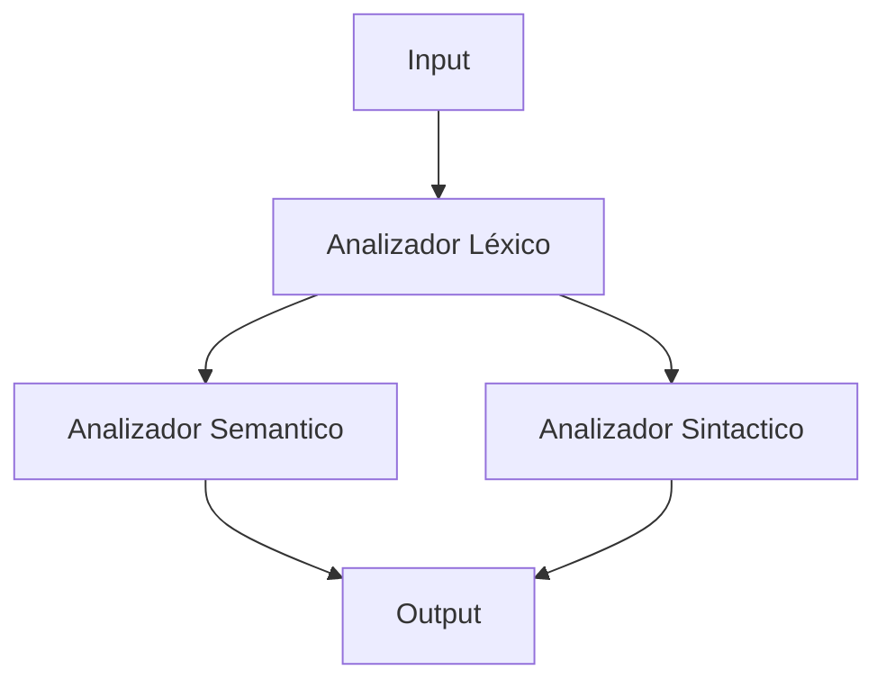

<a href="https://git.io/typing-svg"></a>
# DESCRIPCION DE PROYECTO 📌
Este proyecto es un analizador léxico desarrollado en C# como parte del estudio de teoría de computacion. El programa lee un archivo de entrada con instrucciones o palabras clave, identifica tokens válidos y detecta repeticiones de elementos como personajes, escenarios o acciones dentro del texto.

# Estructura de Nuestro Compilador 🗃️

✅Analisis Lexico  
✅Analisis Sintactico  
✅Analisis Semantico





# HERRAMIENTAS 💻


# Comandos Que Reconoce Nuestro Compilador 🤖 

- **PERSONAJE**
- **NOMBRE**
- **CLASE**
- **ATRIBUTOS**
- **INVENTARIO**

# **Clases Válidas:** 🎭

- **GUERRERO**
- **ARQUERO**
- **MAGO**
- **ESPADACHIN**
- **ALQUIMISTA**
- **DRUIDA**
- **SANADOR**

# **Atributos validos por clase** 
- **GUERRERO:** VIDA, INTELIGENCIA, RABIA, FUERZA
- **ARQUERO:** VIDA, INTELIGENCIA, VELOCIDAD, PRECISION
- **MAGO:** VIDA, INTELIGENCIA, MANA, FUERZAMAGICA
- **ESPADACHIN:** VIDA, INTELIGENCIA, ESGRIMA, GOLPECRITICO
- **ALQUIMISTA:** VIDA, INTELIGENCIA, DESTREZA, INGENIO
- **DRUIDA:** VIDA, INTELIGENCIA, NATURALEZA, TRANSFORMACION
- **SANADOR:** VIDA, INTELIGENCIA, ESPIRITU, CURACION


# INSTRUCCIONES DE USO 🔧
## 1. Primero clonamos el repositorio en una terminal:
```bash
git clone https://github.com/Titolin4612/PF-TeoriaComputacion
```

## 2. Luego entramos a la carpeta del compilador

```bash
cd PF-TeoriaComputacion
```

## 3. Luego entramos a la carpeta donde esta el input y el output
```bash
cd "Compilador Teoria"
```

## 4. Luego Abrimos al archvio de Input ponemos una estructura valida: 

```bash
notepad input.txt
```

## 5. Luego para ejecutamos el compilador con:
```bash
dotnet run
```

## 6. Luego podemos entrar al archivo de Output para ver el resultado mas detallado:

```bash
notepad output.txt
```


# Ejemplo De Input 🧾


```
// Personaje #1
PERSONAJE
NOMBRE: Aragon
CLASE: GUERRERO
ATRIBUTO: Vida = 150
ATRIBUTO: Fuerza = 90
ATRIBUTO: Inteligencia = 60
ATRIBUTO: Rabia = 85
INVENTARIO: Espada larga, Escudo de roble, Pocion de curacion

// Personaje #2
PERSONAJE
NOMBRE: Mercy
CLASE: Sanador
ATRIBUTO: Curacion = 110
INVENTARIO: Orbe sagrado, Vendas, Pocion de espiritu, Amuleto protector
```


# Ejemplo de Output 🧾


```
PERSONAJE
NOMBRE: Aragon
CLASE: GUERRERO
ATRIBUTOS:
  VIDA: 150
  INTELIGENCIA: 60
  RABIA: 85
  FUERZA: 90
INVENTARIO:
  - Espada larga
  - Escudo de roble
  - Pocion de curacion

PERSONAJE
NOMBRE: Mercy
CLASE: SANADOR
ATRIBUTOS:
  VIDA: 100
  INTELIGENCIA: 96
  ESPIRITU: 36
  CURACION: 110
INVENTARIO:
  - Orbe sagrado
  - Vendas
  - Pocion de espiritu
  - Amuleto protector
```


